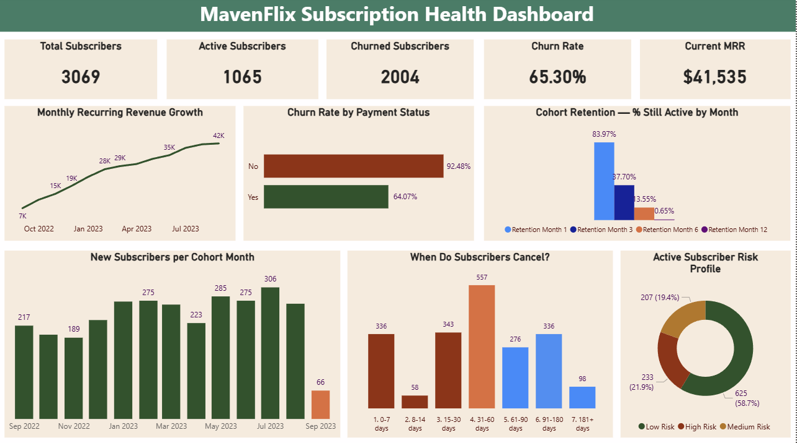
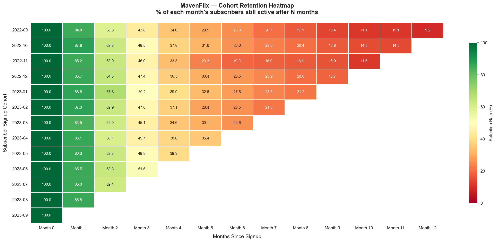

# 📊 MavenFlix — Subscription Churn & Revenue Intelligence

> **End-to-end data analytics project** | Python · scikit-learn · Power BI · DAX



---

## 🔍 Problem Statement

MavenFlix, a subscription-based streaming platform, was experiencing a **65.3% subscriber churn rate** — more than **10× the healthy industry benchmark** of 5–7%. Despite strong revenue growth (+479% in 13 months), the business was losing 2 out of every 3 subscribers.

**Core questions answered in this project:**
- Why are subscribers leaving — and what is the #1 correctable driver?
- When in the subscriber lifecycle does churn peak?
- Which active subscribers are most likely to cancel next month?
- What is the financial impact, and what should the business do?

---

## 📈 Key Results & Business Impact

| Metric | Value | Insight |
|--------|-------|---------|
| Overall churn rate | **65.3%** | 10× industry benchmark of 5–7% |
| Unpaid subscriber churn | **92.5%** | Billing failure = #1 correctable driver |
| Paid subscriber churn | **64.1%** | 28.4 percentage point gap vs unpaid |
| Churn within first 30 days | **36.8%** (737 subs) | Critical onboarding failure window |
| Month-6 average retention | **13.6%** | 86.4% of subscribers gone within 6 months |
| Month-12 average retention | **0.7%** | Near-total churn within one year |
| MRR growth (13 months) | **$7,176 → $41,535 (+479%)** | Revenue growing despite high churn |
| High-risk active subscribers | **233** | $9,087/month revenue at immediate risk |
| ML model performance | **AUC-ROC: 0.997** | Near-perfect churn risk ranking |
| Retention campaign ROI | **3.9× return** | $466 spend → $1,833/month recovered |

---

## 🏗️ Project Architecture

```
mavenflix-churn-analysis/
│
├── 📁 data/
│   └── Subscription_Cohort_Analysis_Data.csv   # Raw dataset (3,069 records)
│
├── 📁 notebooks/
│   ├── 01_eda.ipynb                             # EDA + data cleaning + 4 charts
│   ├── 02_cohort.ipynb                          # Cohort retention heatmap
│   ├── 03_churn_model.ipynb                     # Random Forest ML model
│   └── 04_revenue_forecast.ipynb                # MRR analysis + 3-month forecast
│
├── 📁 outputs/
│   ├── chart1_monthly_signups.png
│   ├── chart2_paid_vs_unpaid_churn.png
│   ├── chart3_when_subscribers_cancel.png
│   ├── chart4_monthly_churn_trend.png
│   ├── chart5_cohort_heatmap.png                # ⭐ Signature chart
│   ├── chart6_avg_retention_curve.png
│   ├── chart7_feature_importance.png
│   ├── chart8_confusion_matrix.png
│   ├── chart9_risk_profile.png
│   ├── chart10_mrr_trend.png
│   ├── chart11_mrr_forecast.png
│   ├── dashboard_screenshot.png
│   ├── churn_risk_scores.csv                    # ML output: 1,065 subscribers scored
│   ├── mrr_monthly.csv
│   └── revenue_forecast.csv
│
└── README.md
```

---

## 📓 Notebook Breakdown

### `01_eda.ipynb` — Exploratory Data Analysis
- Loaded and cleaned 3,069 subscriber records from a raw CSV
- Engineered 6 new features: `is_churned`, `tenure_days`, `cohort_month`, `is_paid`, `signup_month`, `log_tenure`
- Identified the 65.3% churn rate and its distribution across payment status, timing, and signup patterns
- Built 4 business charts including the paid vs unpaid churn comparison (92.5% vs 64.1%)

### `02_cohort.ipynb` — Cohort Retention Analysis
- Grouped 3,069 subscribers into 13 monthly cohorts (Sep 2022 – Sep 2023)
- Built a 13×13 cohort retention matrix tracking % of each cohort still active at Month 0 through Month 12
- Produced a colour-coded RdYlGn heatmap (green = retained, red = churned)
- Extracted average retention curve: Month 1 = 84%, Month 3 = 37.7%, Month 6 = 13.6%, Month 12 = 0.7%
- Key finding: all cohorts decay at a similar rate — confirming a **systemic product problem**, not a seasonal issue



### `03_churn_model.ipynb` — Machine Learning Churn Prediction
- Feature engineering: `log_tenure` (log1p transform to compress tenure outliers), `signup_month`, `signup_dow`
- 80/20 stratified train-test split (stratified to preserve 65.3% churn ratio in both sets)
- Trained **Random Forest Classifier** (100 trees, `class_weight='balanced'` for imbalanced classes)
- **AUC-ROC: 0.997** — confusion matrix: 211 TN, 387 TP, only 2 FP + 14 FN across 614 test rows
- Feature importance: `signup_month` (0.46) > `tenure_days` (0.22) > `log_tenure` (0.21)
- Scored all **1,065 active subscribers** with churn probability
- Applied percentile-based risk tiers: **High Risk (233)**, **Medium Risk (207)**, **Low Risk (625)**

### `04_revenue_forecast.ipynb` — Revenue Analysis & Forecasting
- Calculated exact MRR for every month: `active subscribers × $39` using date-range logic
- Validated 13-month MRR growth: **$7,176 → $41,535 (+479%)**
- Built 3-month weighted moving average forecast (weights: [1, 2, 3] — recent months weighted higher)
- Forecast shows MRR **plateauing at ~$41,000** — strategic warning that growth is flattening
- Quantified **$9,087/month at risk** from 233 high-risk subscribers

---

## 💡 Business Recommendations

### 1. 🔴 Fix Billing Failures — Immediate Revenue Recovery
**Finding:** Unpaid subscribers churn at 92.5% vs 64.1% for paid — a 28.4-point gap.  
**Action:** Implement automated payment retry system and dunning email sequence.  
**Impact:** Recover churned unpaid subscribers at near-zero marginal cost.

### 2. 🟡 Rebuild the 30-Day Onboarding Experience
**Finding:** 36.8% of all churn (737 subscribers) happens within the first 30 days.  
**Action:** Deploy a 5-email welcome sequence highlighting key features in Week 1 and Week 2.  
**Impact:** Reducing early churn from 36.8% to 25% saves ~237 subscribers/month × $39 = **$9,243 additional MRR**.

### 3. 🟢 Launch a Targeted Retention Campaign
**Finding:** ML model identified 233 high-risk active subscribers ($9,087 at-risk monthly revenue).  
**Action:** Outreach at $2/subscriber = **$466 total campaign cost**.  
**Impact:** At 20% save rate → 47 subscribers retained × $39 = **$1,833/month recovered = 3.9× ROI**.

---

## 🛠️ Tech Stack

| Category | Tools |
|----------|-------|
| Language | Python 3.10 |
| Data manipulation | Pandas, NumPy |
| Visualisation | Matplotlib, Seaborn |
| Machine Learning | scikit-learn (RandomForestClassifier) |
| Dashboard | Power BI Desktop, DAX |
| Environment | VS Code, Jupyter Notebooks |
| Version control | Git, GitHub |

---

## 📊 Dataset

| Field | Details |
|-------|---------|
| Source | [Maven Analytics Data Playground](https://mavenanalytics.io/data-playground) |
| Records | 3,069 subscribers |
| Period | September 2022 – September 2023 (13 months) |
| Columns | 6 (customer_id, created_date, canceled_date, subscription_cost, subscription_interval, was_subscription_paid) |
| Price | Flat $39/month for all subscribers |
| Plan | Monthly only |

---

## 📌 Key Learnings

- **Cohort analysis** is more insightful than aggregate churn rate — it reveals whether the problem is improving or systemic
- **Billing failure, not product dissatisfaction**, was the #1 churn driver — a non-obvious finding that changes the business priority
- **ML-based risk scoring** transforms a backward-looking analysis into a forward-looking action list
- **Revenue plateau forecasting** provides the urgency argument for why the business must act now

---

## 📬 Connect

**[Chandana S]| Aspiring Data Analyst


> *Open to Data Analyst, Business Analyst, and Analytics Engineer roles.*  
> *Feel free to reach out — happy to walk through the project methodology.*
